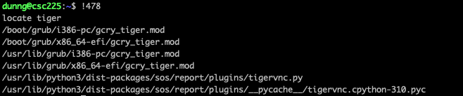
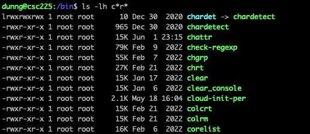

# CIT 225

---


Remember: *EVERYTHING* is a file in linux.

The questions to ask when you are at a shell prompt:

## Where am I? 

What is around me? -- Where can I go? -- What do I want to do?


Without getting too existential. :om: 

### Which computer am I running commands on? 

For instance if you launch and start using `git bash` on Windows or `Terminal` on a Mac then you are "on" or logged into the machine you are sitting in front of. Once you open a remote session to another server such as the class server then you are then said to be "on" or logged into that remote system.

This can be confusing because no matter *where* you *are* the prompt you get looks very similar!


## Where am I in the context of the shell means:

### What is my working directory? 

The command to **print** or **echo** your working directory to the screen is `pwd`

What is a **working directory**?

Your **working directory** is the one that *has focus*. This is a very similar idea to a window *having focus* in Windows or Mac. You must somehow select that window as the one you want to type into. In a GUI environment you do this by clicking on the window. It is something you likely do without thinking about.

Notice what working directory you are placed into when you first log in via ssh or launch the shell application on the computer at your desk. This is your home directory. Everything that is contained in your *home directory* or any child directory of your home you will have full control over making changes. 


## Where am I?

Launch `git bash` or `terminal` and type `pwd` at the `$` prompt.

What output do you see?
Where does this directory physically live?


Now that you know where you are both in terms of which computer you are executing commands on (the computer you are in front of) as well as what directory on that computer has focus (our current working directory) we can look at what is inside of this directory. This will be something like `/c/Users/<your username>` on Windows or `/Users/<your username>` on a Mac. 


## Look around

The next thing you might want to do is see what is in this *home directory* of yours. The command to do this is `ls` which is short for listing or list. [^1]

```bash
ls
```

This will show you a list of the files and other directories that are contained in the current working directory. If I do this on my Windows machine with git bash I get something like the following

  
Windows Users: [^2] 

If I do the same thing with the Terminal app on a Mac I get something like this.


## Go somewhere else

To change into another directory you use the `cd` command. This stands for **change directory**. This command is essential in navigating around the filesystem.

Let's go back to the terminal app on your local machine and then run the command 

```bash
cd Downloads
```

This will change the *working directory* to the `Downloads` directory that is inside your  *home directory*.

Next we will perform the `ls` command again. This will now instead of listing the contents of your *home directory*, list the contents of the Directory that contains the files you have downloaded from the web.


 

Now let's go back to the home directory. `cd` without any parameters will always take you back to your home directory.

```bash
cd
```


## Run Something

Well technically we are already running a [bash shell](https://www.gnu.org/software/bash/manual/bash.html) on our local computers. However since some of you are on Windows and other Macs and maybe even a few on some linux flavor we need to get connected to the class server via `SSH` so that commands will work the same for everyone. *If you are unsure how to do this please reach out.*

The particular program that we run (execute) that gives us this `$` prompt we keep seeng everywhere is called the `shell` (interface). That particular program we are using is called [`bash`](https://www.gnu.org/software/bash/manual/bash.html). It is part of the GNU set of tools and is probably the most common shell in use today. 

We want to `execute` something *else* though. `Execute` is not as in take a life although in some since something is created and dies when you run a program, but as in `carry out`. As in `execute` an order.

As an example of executing a program (command) once you are connected to the class server let's run (execute) a fun little ditty called `fortune`. It just gives you a random fortune each time it is invoked.


ASIDE: We will later discuss that you can (and probably should) use a more featureful shell like [Z shell](https://zsh.sourceforge.io/) (`zsh`) (I like to use it with [Oh My Zsh](https://ohmyz.sh/) for everyday use. 

NOTE: Even if you change your login shell to something like `zsh`, `bash` still has it's place when scripting!  


***NOTE: From here forward assume all examples are performed while connected to the class server via ssh. ***

## Options vs Arguments

The format for a typical command in linux is 

```bash
$ <command> <options> <arguments>
```


`<command>`: The name of the command (such as `ls`). 

`<options>`: Start with a single hyphen/dash `-` for single letter aka "short" options and `--` for long options. Long options are usually whole words and are more human readable and better to use in scripts.  

`<arguments>`: This is the thing that the command operates on (usually a file). 

Next as an example let's use a short option with `ls`

## Hidden Files and Directories


Linux has a concept of making a file or directory **hidden**. This only means that they do not show up by default with `ls`. To make something hidden the only thing you have to do is name it with a name that begins with `.`  

Let's re-run the `ls` command on the class server.  

```bash
ls
```

When you first start out you will see an empty list like so:  


Technically no directory is ever empty. Every directory will automatically have two hidden directories  contained inside.  

`.` 
 
and  

`..` 

 `.` is a shortcut for the current *working directory*.  
 
 `..` is a shortcut to the directory one level up from the current *working directory*. 

You can use these shortcuts in various ways. 

- `..` is mostly used with `cd` to take you one directory level up in the tree. Or even multiple levels at once via `../..', `../../..`, etc.
- `.` is mostly used as a shortcut to the current directory such as when specifying a command to execute. ( `./my_script.sh` )

The option to tell `ls` to show hidden files and folders is `-a` (or `--all` for the long option). Let's try it.  

```bash
ls -a

ls --all
```

   


## Long Listing

The next option we will discuss is the **long** listing for `ls`. It just shows us the same list of files but with more details.

Before we run the command let's first change our *working directory* to the directory `/etc`.

```bash
cd /etc

ls -l
```


Don't worry about what all these things mean right now. We will keep coming back to this view of things and it will make more sense each time!

## Reverse Listing Order

Another useful option for `ls` is **reverse** aka `-r`. This option will reverse the sort order of whatever you are sorting by. The default is the filename.

Be Careful: Some commands use `-r` to indicate **recursive** 

## Combining Options

It is perfectly ok to combine short options in either of the following ways

```bash
ls -a -l -r

ls -alr
```

You can also combine short and long options as well

```bash
ls --all -r
```

## Create a New File

There are many ways to create files in linux but this is simple and useful.

The command is `touch`.

```bash
touch my_new_file
```


*The touch command technically updates the timestamp of a file but it will also create the file if it does not exist.*

## Make a Copy of a File

The next new command is used to make a copy of a file.

It is called `cp`.

```bash
cp my_new_file my_brand_new_file
```


## Delete a File

The command to delete a file is `rm`.

It is called `rm`.

```bash
rm my_brand_new_file
```


## Aliases

Aliases allow us to make shortcuts for commands that we use often. When we set an alias it is good for that shell instance. So if you log out and back in it will no longer be there (you can set it to be automatic, more later)

```bash
alias short='really_long_command -ab -long-option'
```


Aliases are only to save keystrokes and does a literal text substitution at runtime. They can be useful the main drawback is using them enough to remember and then the pain it is to sync up all your enviroments to have it because they will not be default. It may be more effcient to just type a few extra keystrokes for something that will work with things out of the box.

## Tab completion

Probably the single, easiest thing you can do to save keystrokes at the command line is to use **tab completion**. 

All you need to do is start typing a command (or filename) and hit `TAB`

One of two of the following will happen:

1. If what you have typed is unique it will happily complete typing the rest of the name for you.
2. If you you have typed is *NOT* unique then nothing will happen. At that point if you hit `TAB` again it will show you a list of all the matches. You can then continue typing and hit enter once you have a unique match.


## Getting Help

Linux comes with online documentation that can be viewed through a program called `man`. Not all commands will have a man page but most commonly-used commands will have one.

To view you just type `man` and then name of the command.

```bash
man ls
```

To navigate inside `man`: 

- use the `j` and `k` keys to go up and down single lines at a time.
- Use the `<SPACE BAR>` and `b` to go forward and back whole pages at a time.

`q` quits.


## Shell Variables

Like any scripting language `bash` has variables. They act just like variables in a language like `python` and are used to store values for later retrieval.

The way to set a variable is pretty straight-forward.

```bash
this_var='is awesome'
```

Now that we have the value stored we must use the `$` to dereference and read the value stored in the variable.

```bash
echo $this_var
```


This is called a **local variable** 


Like an `alias` a **local variable** is only there for as long as that shell instance is still running. If you log out or launch another shell, the variable will *NOT* be there.


You can set a shell variable that will persist in any child shells or *commands* that are subsequently launched. This is called an **environment variable** and is set by the using the keyword `export`.

```bash
export THIS_VAR='is even more awesome'
```

We can then launch a new shell and the variable will still be set


*Note: By convention local variables are named in lower case letters and ENVIRONMENT variables are named in UPPER CASE.*


If you no longer need a shell variable to be set you can use the keyword `unset`.

```bash
unset this_var
```


## PATH environment variable

One of the most important environment variables that will be present on every system is the `PATH` variable. This is just a normal variable that contains a `:` delimited list of filesystem path locations. It is special becuase it is used by the shell to determine which locations and the order that the locations will be searched for a command when you type it into the shell prompt.
 


The `which` command will tell you the location from the list contained in `PATH` of the actual file you are *executing* when you run a given command. Like the `echo` command, if which does not find a match it will not produce an error but does give blank line of output.


 
## Absolute and Relative filesystem paths
 
The `PATH` environment variable is not the only way that the shell can find a command to run.

Two other ways:

- Absolute path: Always starts with a `/` and specifies the command location from the root of the filesystem. Exact but can be really long if the command is deep in the filesystem. 

```bash
/home/dunng/bin/my_rad_app
```

- Relative path: Will start with somethign besides `/`. Specifies the command location relative to the current working directory. 

```bash
bin/my_rad_app
```

Sometimes you may want to modify the `PATH` variable to search in new places. One common location might a `bin` directory in your **home directory**. You could then place scripts and programs you write into that directory and they would be available for use in all **working directories**.

Next we are going to install a tool that will help visually drive home some of these concepts.

## Installing your first Go app

[Go](https://go.dev/) is a relatively new but up and coming language that originally came out of Google. It is an easy to pick up language that has a lot of features that make it well suited to things like the cloud where fast, secure, and scalable are necessities. Go does not have an interpreter like Python or a virtual machine like Java. It instead compiles everything directly to machine code (Assembly Language). This makes it really fast. It also has concurrency as a primary design feature. Parallel programming is never easy but Go has tools to help ease the load.

This is not a Go class obviously but I do want you to see this tool that can help make some of this filesystem navigation stuff make more sense. The tool is written in Go and called `lf`.

[Go](https://go.dev/) is already installed on the class server. The command you will run only downloads and installs `lf` and all its **dependencies**. 

**Dependencies** are other modules as go calls them. Other languages or contexts might call them packages or libraries but no matter the name **dependencies** refer to things are required to run a piece of software.

It is an open source project available on [GitHub](https://github.com/gokcehan/lf)

If you read the `README.md` it tells you the command to install the app. HINT: It is the one for **Unix (Go version >= 1.17)**


This command downloads and installs `lf` and all the other stuff needed to run `lf` into `~/go` (aka `/home/<your user>/go`)

Another useful tool to visualize filesystem layout is called `tree`. Let's use it now with a few options to limit its output to the newly created `go` directory along with two levels of recursion.


As you can see from tree (hehe) there are two things in the `~/go` directory. You just created your very first [Go Workspace](https://go.dev/doc/code#Workspaces)!

1. `bin`: As in linux, `bin` in this case also means `binary` and refers to **executable** files. If you notice our `lf` command is shown in this direcotry.
2. `pkg`: This directory is short for `package` and is an archive of all the go code that you are just reusing and have not modified.

Now what will happen if we try to run our new command `lf`?

```bash
lf
```


Why is `lf` not found?

How can we run lf?

One way would be to enter the **relative path** [^3] to the file ( `q` quits ):

```bash
go/bin/lf
```

Another way would be to enter the **absolute path** to the file.

```bash
/home/$USER/go/bin/lf
```

`USER` is a built-in environment variable that is automatically set to the user that launched the shell's username. In my case this would expand out to `dunng` when executed. You can always just type in your username instead of `$USER` but if you ever do that in a script and then want to share the script with other users it will require you to make changes you would not have to make if you use the variable.


Hint: Use the `h`, `j`, `k`, `l` to navigate.

`q` to quit


This provides a nice graphical view of the filesystem.

Notice on the bottom there is a long listing the the item currently highlighted as well as a counter telling you what number file you are in the list. If the item you are highlighting is a text file it will even show you the contents. Very slick.


Now we want to make it to where you can just type `lf` anywhere and launch this application. 

How can we do that?

Add it to `PATH` of course!

```bash
PATH=$PATH:$HOME/go/bin
```

`HOME` is another built-in environment variable that is automatically set to the user that launched the shell's **home directory**. This would expand out to `/home/dunng` when executed. Also useful in scripts.


Now if we type `lf` no matter where we are!

For at least as long as you are logged in. If you log out and back in you will have to re-set the `PATH` variable.


## Making things persist

So far we do not know how to make environment variables persist once we log out and back in. Even the `export` keyword will not take care of that.

How do we make this change **stick**?

We need to figure out a way to have the `PATH` variable modified every time a new shell instance is launched so we don't have to remember to or re-type with each new `bash` shell we run.

Sounds great... How do we do that?

We need to leverage what happens every time a new `bash` process is launched.


## Bash Shell Start Up

`bash` has a set of initialization files that run everytime a new shell instance is launched.

The `login shell` which is the first one that gets launched under your user name when you log in is an interactive shell. That means that you are seeing a `$` prompt and typing commands directly on that prompt.

A `non-interactive shell` is used to run something like a script that will launch and exit the shell process automatically. The script may ask for input but the shell underneath is `non-interactive`.

Here is a table that will help to see the difference as far as this initialization process is concerned:

| Login Shell | Interactive Shell | Non-Interactive Shell |
| :---:  | :---:  | :---:  |
| `/etc/profile` | | |
| `~/.profile` XOR `~/.bash_profile` XOR `~/.bash_login` | | |
| `~/.bashrc` | `~/.bashrc` | |
| `/etc/bashrc` | `/etc/bashrc` | |
|               |               | [`source $BASH_ENV`](https://www.gnu.org/software/bash/manual/bash.html#Invoked-non_002dinteractively) |

Note: Scripts that are located in `/etc/` are only modifiable by root and the ones in `~` ( aka `/home/<user name>` / aka `$HOME` ) are modifiable by us as a regular user.

It is interesting to note that the admin script runs first for the `login shell` to allow for the user to customize any changes made by the root.

The root user however has the last say as `/etc/bashrc` runs last.

As we can see from the chart, the file in this sequence that runs with each new shell that we can modify as a normal user is the `~/.bashrc` file. 

So in order to make our `go` path stick we just add the line that sets the `PATH` variable to the end of the `~/.bashrc` file.

```bash
echo 'PATH=$PATH:$HOME/go/bin' >> ~/.bashrc 
```

Note: `I` as in my user *could* have entered the following and it would be the same and it would work for you if you changed out my username for yours. I just want you to see that using the `HOME` variable is the same as writing it out for your own user.

```bash
echo 'PATH=$PATH:/home/dunng/go/bin' >> ~/.bashrc 
```

Viola! Now we can log out and back in and still have all the goodness of `lf` at our disposal.

This works great for `go` programs but setting that path is pretty limited to `go` stuff. What if we want to have a place that we can put our other, more general, executable files?

It turns out there is a built-in way to do this that we only need to enable.


If we look at the contents of our `~/.profile` script we some some stuff like this:


This is the first example of `bash` script we have seen and it has not one but TWO `if` statements. Oh No! haha j/k I know you all have seen `if` statements in python before. This is no different! :)

So those lines will add to `PATH` either of the respective directories listed each time a new shell is launched. The `if` just check to see if they are there and only adds if the directories exist.

- `$HOME/bin`
- `$HOME/.local/bin`

TL;DR

Let's make a `$HOME/bin` directory that will automatically be added to `PATH` without us having to make any additional changes.

```bash
mkdir $HOME/bin
```

Why two directory options? [^5]

Wait.. We don't have a script to execute you say? Never fear!


## Your first script!


The most basic program anyone ever writes in any new language is the glorious `Hello World`. I did not want to disappoint. You don't even have to learn `vi` (yet) for this!

First let's create the script (from your **home directory**):

```bash
echo "echo 'Hello World' " > hello.sh

chmod a+x hello.sh
```

Now we need to test:


```bash
/home/dunng/hello.sh
```

Notice that we had to specify the **absolute path**. If we had just tried to type the script name directly the shell would tell us it could not find the file. This is because `PATH` on our system does not include the current directory. We can modify it to do so. Can you think of how?

![script test] (./images/script_test.png)

If we want this script to be available in our **home directory** (or any directory) we can simply move the script to the `bin` directory we just created and added to out `PATH`.

```bash
mv hello.sh bin

hello.sh
```


## Making history work for you

If one has not yet seen or figured it out: Using the up and down `arrow` keys we can scroll either direction through the previously run commands. You can edit the command as well using the left and right `arrow` keys, delete and backspace as normal before hitting `enter` to execute.

The up and down `arrows` that you are using to scroll through and re-execute recently used commands are actually reading and writing to a file in your home directory called `~/.bash_history`.

You can look at this file directly with the use of the `history` command.


As you can see each historical command will have a number beside. 

To run that command you just enter `!` followed by the corresponding number.




***Important point: In the `bash` shell itself `!` has a special meaning. Which is to execute a command from the `history` list.***

***While we are on the subject: `!!` also has a similar special meaning. It will execute the last run command***


[This is an excellent article with lots more information about history](https://www.redhat.com/sysadmin/history-command)


## Pattern Matching

Pattern matching is perhaps one of the most innate things human beings do. Out of the plethera of data we are constantly being innudated with being able to pick out the pieces that are important is critical to survival.

While finding that critical error that is making your app crash in a log file may not be as important as finding something to eat. Pattern matching is an important aspect of using linux.


## Globbing

There are two main ways to do pattern matching in linux.

1. **Regular Expressions**
2. **Globbing**

We will be covering **Regular Expressions** as well. They are more powerful than **globbing**.

Globbing is really simple. There are basically only four characters used.

- `*`
- `?`
- `[`
- `]`

`*` : Matches anything, zero or more times.

`?` : Matches anything exactly once.

`[]`: Come as a set and each set only match one character. 

## Globbing It Up with `Ls`

You can use globs with many commands (`cp`, `mv`, `rm`, just to name a few). Now let's see some examples using a command we have run into before: `ls`.

First let's change into a directory that has a bunch of files we use to practice our pattern matching. `/bin` is a good choice.

```bash
cd /bin
```

First let's take a closer look at these files. Lets just do an `ls`.

```bash
ls
```

Notice you see a bunch of text go by and you can only see the bottom portion of the output. Depending on how much output you can scroll up in your terminal client and see everything but that will not always be possible.

When it is not possible to see all the output of a command either because of the way you are running things or that it just fills up the buffer of your terminal program you can again use the `|` ( **pipe operator** ) and send to something like `less`. 

I know more new things! Sorry! 

The ( **pipe operator** ) `|` takes the output of the command on the left side is and sends it as text as the input to the command on the right side, in this case the view program `less`. 

`less` is the standard file pager and has the same viewing controls as `man`. 

```bash
ls | less
```


Now as another way of looking at things and an example of using `|` let's see how many files there are in this directory. 

Any ideas on how?

An easy way to do that is to use the `|` aka the **pipe operator** again and a little utility called `wc`.

```bash
ls | wc -l
```

The output of `ls` is sent to `wc` one file per line as you can see above so if `wc -l` counts the number of lines it sees then you will also have the number of files in the directory. :mage:


As you can see at this point there was 1099 files in `/bin` on the class server!

## Now Some Practice.

We saw that the `*` character matches zero or more things so a simple example would be.

```bash
ls -lh h*
```

This will give a long listing all of the files in `/bin` that start with a lower case `h`.


 This time lets find all the files that start with a `c` and then is followed either directly by `r` or ends in `r` 

```bash
ls -lh c*r
```


You can also use globs multiple times in an expression. Here is the same thing as the previous example but instead of ending in `r` it starts with `c` and has `r` somewhere in the rest of the name.

```bash
ls -lh c*r*
```


Now let's use the `?` now and look for all the files that have five letters and start with `t`.


```bash
ls -lh t????
```


You can mix and match different types of globs. Here is a glob that will match anything that starts with `l` and has at least nine characters.

```bash
ls -lh l????????*
```


How about another `?` one. Let's look for all the files that have five letters in the filename.


```bash
ls -lh ?????
```

This command produces too much output to see everything without scrolling or piping to something like `less`. Perhaps we only want to know how many files match the glob pattern?

Let's do it again but this time use the `|` and send the output to `wc -l` again to count the matching files.

```bash
ls ????? | wc -l
```

How about six? ... or seven?


Now for the slightly more complex `[]`. As we said before the pair of square brackets (`[]`) represent one single character.

As an example: `[a-d]` would match a single lower case letter that is one of `a`,`b`,`c`,`d`.

An equivalent glob to this would be `[abcd]`.

As an example let's look at the files in the `/etc` directory. The `/etc/` (pronounced 'et see') directory by convention contains configuration files for the various apps and services that run on the system.

First lets change to the `/etc` directory.

```bash
cd /etc
```

Aside: What kind of path is that?

If you do just a normal `ls -lh` you will see a lot of files and directories. The directories we are interested in matching start with `rc` and have numbers `0` through `5`.


If we try to use what we have been using with `ls <glob>` with a directory it will list the matching directories. We *DO* want that but it will also list the *contents* of those directories (which it should so as that is what the tool is for :grin: ) *BUT* makes the output hard to interpret and not very helpful for the purposes of this exercise. 


*HOWEVER!* We can use an option to `ls` that only lists directories (`-d`) that will give us the behavior that we want to match the **glob**.

Let's check it out (still from `/etc`):

```bash
ls -ldh rc[0-5].d
```


This are just a few examples but should be enough to make us dangerous. :smiling_imp:


As you can see there are many nuances and caveats with **globs**. They can get as complicated as you might want to make them and there is almost always multiple ways to do *EVERYTHING*. These things also true of **linux** in general.

Please also remember **globs** are case sensitive as well so capital and lower case makes a difference!

## Aside About Downloading Files

We are about to download an ebook from the internet to practice searching but before we do that I want us to think about the question: 

Where am I? 

For instance: If you go to the browser right now and download a file... 

- Where does that file live? 
- Is it accessible from the class server?

When you download a file using the browser of your computer it will typically place the file into the `Downloads` directory of your user's home directory. This is true with Mac, Windows, and Linux. [^4]

This file you just downloaded lives on the computer you are in front of. If you want to have that file avaialable you must copy it up to the class server. We will learn how to do that but that would require two steps. 

1. Download the file to your local computer
2. Transfer the file from your local computer to the class server.

Why not cut out the middle man and download the file directly to the server from the remote terminal session? Let's do it.

While there are terminal-based web [browsers](https://lynx.invisible-island.net/) that can come in handy, the most commonly used tools for downloading files to a remote system in a terminal session are `wget` and `curl`. 

We will now use `wget` to download a file that we can use to practice searching.

I am feeling kind of dark today. How about a little Edgar Allen Poe? [The Raven](https://www.gutenberg.org/ebooks/17192) is available for free as a [plain text file download](https://www.gutenberg.org/ebooks/17192.txt.utf-8). 

If you are not already: Change back to your `$HOME` directory. 

The easiest way to do this is to enter `cd` without any arguments.

```bash
cd
```

Now let's use `wget` to download the book and save it as `the_raven.txt`:

```bash
wget https://www.gutenberg.org/ebooks/17192.txt.utf-8 -O the_raven.txt
```


Awesome!

Now the book is in our **home directory** as a new text file called `the_raven.txt` :fire:


## Grep


One of the most commonly used tools to do pattern matching is a command called `grep`.

`grep` is most commonly used for pattern matching filtering with a stream of text via a `|` but the most simple way to use it is to search for text in a file.

Note: `grep` uses **regular expressions** instead of **globbing**. Regular expressions can be tricky but do not fret! We will stick to the easier side of things.

HINT: It is not going to matter in this case. :wink:

By default grep will just search a file. Let's search our ebook for the occurances of the word `nevermore`.

```bash
grep nevermore the_raven.txt
```


As you can see the command dutifully searches the file and everytime it sees a line that contains the word `nevermore` it spits out the *entire line*. Not just the matched text.

- Is this all the times `nevermore` appears?
- What if it was the first word in a sentence? (`Nevermore`)
- Do we know of a pattern that will match a single character with one of two different options?


Yes. Yes we do. :thumbsup:

If we use the `[Nn]` pattern it should do the trick. Let's try.

```bash
grep [Nn]evermore the_raven.txt
```


Great now we are finding all of them! 

Can you think of what we might do to just count the occurances?


## Grep a Cat?

Let's introduce a new command called `cat`. This is a neat little tool. If you give `cat` a file as its argument it will print the contents of the file to the terminal. Let's try it first with our book.

```bash
cat the_raven.txt
```

This is another case where a lot of output is spit out and we only see the last little bit. If we care about looking at the whole thing then we might use the `|` and send the output of `cat` to or old friend `less`.

```bash
cat the_raven.txt | less
```

Now we can view the file one page or line at a time. 


As we said before `grep` is very commonly used to filter text streams with the `|` operator. Let's see an equivalent version of the `grep` command from before that instead of calling `grep` directly uses `cat` and the `|` to send the output to `grep`. This gives the exact same output as previously shown.

```bash
cat the_raven.txt | grep [Nn]evermore
```

While we are talking about text streams, `|`, and `grep` let's mention another useful command `set`.


## Set it Up

`set` ( think of the name as short for `settings`) is an [odd little command](https://phoenixnap.com/kb/linux-set). It has really useful options but it is not very *Unix-like* in that it is a bit scattered in its function. 

Some of the thigs it can do:

- Allow for debugging with `-x`. 
- Automatic exporting of things set in scripts that are run with `-a`.
- Prevent overwriting of data by limiting output redirection.
- Have a script exit on failure to prevent any damage that might occur later in the script as a result of the error.


If you give it no arguments it will print out all of the settings (variables and scripts) that are present in the current script. This makes it useful to use with a filtering via a tool like `grep` to search for specific things. Let's check out out.


```bash
set
```

As we are becoming accustomed this is another command that spits out a bunch of stuff that we need to scroll to see.

What do we do? 

Let's pipe it to `less`.


```bash
set | less
```

As promised when you page through (`<SPACE>` forward, `b` back, `q` quit ) you see that `set` gives you all of the variables and scripts set in the running shell.

As we look through the list you will notice that in many cases variables that are for a particular app will all share a common *prefix*. 

If we know the *prefix* for a given command (or even the first few letters of the prefix) we can combine `set`, `grep`, and `|` (also don't leave out our friendly neighborhood `*`)  to show just the variables we care about.  

Let's say that we want to see all of the variables that have to do with the `history` command. We happen to know that the term `HIST` is the *prefix* so we can do something like this:

```bash
set | grep HIST*
```


Super handy.

## Long Listings in Ls

We have seen these enough. Now it is time to talk more about what the fields mean.

First let's change into a different directory (`/etc/update-motd.d`) via an **absolute path**.

```bash
cd /etc/update-motd.d
```

If we want to read more about what this directory does click [Here](https://manpages.ubuntu.com/manpages/jammy/en/man5/update-motd.5.html)

Now let's do our normal `ls -lh`.

```bash
ls -lh
```


Let us in particular look at this one file:


*`92-unattended-upgrades` is a really simple script that is run everytime we log in and will change the output of what is displayed based on if there are any pending system package updates.*

That is not really important so let's get right into it:

The very first field of the **long listing** is the `file type` field. It will usually be one of the following:

Remember: *EVERYTHING* is a file in linux.

| File Type | Description  |                       
|   :---:   | :---         |                       
|    `-`    | Regular file |                       
|    `d`    | Directory    |                       
|    `c`    | Character device: Peripherals such as mice, keyboards, printers. Audio and graphics cards are also character devices |
|    `b`    | Block device: Storage devices such as hard disk drives and solid state drives as well as system memory (RAM)
|    `s`    | Local Socket: These files are used to allow two processes running on a system to communicate. |
|    `p`    | Named Pipe: Similar to Local Sockets. Also allow for two processes to talk to each other.  |
|    `l`    | Symbolic link: Files that point to files in other directories. There are two types. **hard** and **soft**. We will talk more about these. |

In our role in IT or as a Systems Administrator we will really only concern ourselves with the first four from the previous table.

That one was easy. The next field is a bit more tricky but not too bad.

This is the `permission` field.


Please note there will always be `9` places in this field. One for each of the abilities to `read`, `write`, and `execute`. For each of the following categories of users: `user owner` of the file, `group owner` of the file, and `everyone else` or the world (even those not logged into the system!). We will come back to these a lot so don't worry!


The next fields are the `user owner` and `group owner` respectively


In this case `root` user and `root` user group. 

As the names imply this is the system user that `owns` the file and the system group that `owns` the file. By default this is going to be the user and group that created the file. I know they have the same name in most cases. It makes it confusing.

Next up is the size of the file in bytes by default. 


In this case the size is `165` bytes.

*Note: I will typically add the `-h` to ls so that file sizes are human readable (ie display in `KB`, `MB`, `GB`, etc.) but this file is so small that it just displays in bytes.*

Next we have the timestamp. Well one of three timestamps. The `last modified` time.


In this case `February 19th 2021`. This is actually a [Unix Timestamp](https://unixtime.org/). The precision is down to the millisecond and represents how many seonds have elasped since `January 1, 1970` 

Last but not least is the name of the file itself.


Here is a neat little graphic on a website explaining permissions and ownership. Image is link to site.

[](https://www.thegeekdiary.com/understanding-basic-file-permissions-and-ownership-in-linux/)


I hope by now some of the recurring themes are starting to seem somewhat familiar. Keep at it! It will geat easier! Let's get on with it!


## More commands for dealing with files

There are commands that give us information about files. One of them is called `file`. This command will tell us if a file is plain text or a binary executable file for instance. This is useful if we are unsure of what kind of data or code a file might contain.

Let's look at a couple of examples:

```bash
file the_raven.txt
```


As expected it shows us that this file is a `UTF-8` Unicode text file. sweet.

How about our `lf` command?

```bash
file ~/go/bin/lf
```


Also as expected it shows us that this is a binary `executable` file.

We have mentioned `touch` before. It is a file that can is used to update timestamps on files as well as create new, empty files. 

The `touch` command changes the *modification* time of the file. There are two other timestamp fields, *access* and *change*. *Access* is the last time the file was read and *change* refers to the last time any attributes about the file were modified, such as permissions.

we can view the all timestamp values with the command `stat`.


`cp` is the command used to create a replica of another file. It takes at least two arguments `<source>` and `<destination>`

Here is a quick example:

```bash
cp the_raven.txt the_raven_backup.txt
```


If we ever want to check to that two **text** files are the same and be shown a line by line difference if the are not the same use the command `diff`.

```bash
diff the_raven.txt the_raven_backup.txt
```


If there had been any differences thenit would have told us about it instead of exiting.

Another way to check to see if two files are the same is to use a hashing algorithm. If the output of the hashing algorithm for the two files matches then the files are the same. Unlike `diff` this technique will work for both text and binary files.

Let's use a command called `sha256sum` to test our files.


```bash
sha256sum the_raven.txt
sha256sum the_raven_backup.txt
```


These match so we are good!

Many times sources that provide file downloads will also provide some sort of hash checksum that we can use to verify that the file we got is the smae one the source intended.

we can also copy files from one directory to another.

```bash
cp /etc/lsb-release ~
```


The previous command copies a file in `/etc` called `lsb-release` that contains information about the version of Ubuntu that the class server is running to our **home directory**.

What does the `~` mean?

Just for grins let's take a look at the contents our new copy of the file.

```bash
cat lsb-release
```


- What is special about this copy that is not true of the original?
- Can our user make changes to the copy?
- Can our user make changes to the original?
- Who owns the original?
- Who owns the copy?


we can also use *globs* to select more than one file to copy.

```bash
cp /etc/rc1.d/* ~
ls
```


In the previous example we copy all the files from `/etc/rc1.d/` into out *home directory* and show the newly copied files. Don't ask me why :joy:

`cp` can also deal with recursion using the `-r` option. We will leave that as an exercise to do own your own but in the meantime let's learn how to get rid of the mess we just made. 


## Taking Out the Garbage

We need to delete but how are we going to go about the deleting?

We could delete each of those files one by one with a singlecommand for each file. That would not be too bad even if the filenames were long if using `TAB` complete but we are **really** lazy.

Let's take a look at that directory listing above. Is there anything common to those newly created files that we might use to *glob* on to select them all at once?

It appears they all begin with `K` so we could use something like the *glob* `K*` to match them all.

The command to delete files is called `rm` and it can take glob arguments. Awesome. 

There is no recycle bin or trash can on the linux command line `rm` so let's try it first with something like `ls` to make sure we are selecting the stuff we are intedning to select so we won't have a bad time m'kay.  :broken_heart:

```bash
ls K*
```


All looks good lets go ahead and delete the files.

```bash
rm K*
```


Sweet! We are going to be command line wizards in no time.

Technically we could get by with just `cp` and `rm` but thankfully there is a command called `mv` that will move a file from one directory to another. It can also rename a file.

As an example lets say that we are finished with the `the_raven_backup.txt` file but we do not want to delete it for good.

We remember something about there being a place in the linux filesystem that we can put things that we don't care about and will likely never need again.

That place is called `/tmp`.

Unlike most every location at or directly a child of the root of the fileystem `/`, anyone can write to this location so it will make a suitable spot for this file `the_raven_backup.txt` that we are *pretty* sure we will never need again.

 ```bash
 mv the_raven_backup.txt /tmp
 ```


All is well. The file was moved. 

Since everyone on the system has access to `/tmp` and everyone on our class server would be trying to move a file named `the_raven_backup.txt` there, only the first person to do it will be successful. Remember there can only ever be one file by a given name in the same directory.

The next time a different user tries to do it they will get a `permission denied` error. ( This is due to something called a `sticky bit` we will get to later.)


This means we will also need to do something to change the name when we move so it will be unique for everyone in the class. There are lots of things we could do but this time let's use the variable `$USER` and add it to the end of the filename to avoid name collisions.

```bash
mv the_raven_backup.txt /tmp/the_raven_backup_$USER.txt
```


Another necessary tool we need in our bag of tricks is the ability to create directories. This is done with the command `mkdir`.

Let's make a directory named `example_dir`.

```bash
mkdir example_dir
ls -d example_dir
```


`mkdir` can only make one level of directory at a time unless we use the `-p` option.

Let's try to make a new directory with a different name with two levels called `my_dir/example_1`

```bash
mkdir my_dir/example_1
```


```bash
mkdir -p my_dir/example1
```


`mkdir` can also create multiple directories at once if we give it more than one argument.

```bash
mkdir this_dir that_dir countdown1_dir countdown2_dir
```


Let's say we want to create mutiple directories all having the same name but with numbers in the middle of the name... with one command. We could do something like this.

```bash
mkdir new{0..9}_dir
```


Neat huh?

This uses the same `bash` process as globbing called `shell expansion`.


`shell expansion` is also responsible for hidden files not being seen by globs with commands like `cp` unless [special arrangements are made](https://unix.stackexchange.com/questions/89749/cp-hidden-files-with-glob-patterns).

The only other item to talk about in this category of commands is `rmdir`. As it's name implies, it's sole purpose in life is to delete directories. It kinda sucks at it though. The directory has to be empty.

This is a safety feature but if we are sure we want to delete a directory and there is stuff in it we can use the recursive option to rm to delete directories.

Let's use it now to delete all the directories we just created.

```bash
rm -r *_dir
```


Feel free to delete anything that we created we no longer need.


# Finding Files

There are two main commands used to search the linux filesystem from the command line.

1. `locate`
2. `find`


The main difference is that `locate` uses a database that is updated once per day by default and `find` searches the filesystem in real time.

## locate

Here are some examples with just searching the filesystem for files that have random big cat names. I then failed to find one for `giraffe`.


This command can do globbing (or even regular expression pattern matching) but as we can see in its most basic case it just does a substring match. This is basically an implied leading and trailing `*`.

TL;DR

- Advantage: fast, easier to use
- Disadvantage: Its database is stale by as long as it has been since the last update.

## find

As we just said, the `find` command searches the filesystem in real time so it will be a lot slower if it has to sift through a ton of files. We can typically limit the number of items `find` sees via pre-processing in a previous command that we then pipe or even by the options and path we give `find` to speed things up. It can take literally days on some systems to run a `find` from `/` without any of those restrictions.


Let's see some examples.


TL;DR

- Advantage: Up to date
- Disadvantage: Slower, more complex


## How to skin a cat

Let's first create some files to test.

```bash
create_test_files.sh
```

It can also take multiple file arguments and will display the contents of each of the files in the list in the order they appear.

We have already seen this next command. We have used it to show us the contents of a single text file. 


```bash
cat file1 file2 file3
```


As we can see it prints out the contents of the three files one after the other.

Can you think of a way to use a *glob* and specify all filenames at once?

```bash
cat file[1-3]
```

Will give the same output as the longer version.

Another useful trick is to send the output of a command like `cat` to a new file. 

```bash
cat file[1-3] > file_all
```


We will come back to output redirection later.

As we have discussed previously if we have something we are trying to view that is larger than we can easily scroll up to see we will need to use a tool like `less`.


## Less is more

Let's practice using `less`.


There are random plain text versions of various famous books that are in the public domain on the class server are located in `/srv/ebooks`.

What command would we use to see what books are available?

Perhaps the easiest thing to do would be to use `ls` with the `absolute path`

We could also `cd` in the directory and run `ls` but that would be two commands, plus another to go back to where we started. Not very efficient.


```bash
ls /srv/ebooks
```


```bash
less /srv/ebooks/TaoTeChing.txt
```


The `h` key will give use some help on navigation and other options while in the app. 

`q` will take us back to viewing the file and `q` again will quit.

`<space>`  one *page* FORWARD

`b`  one *page* BACK`

`j` one *line* DOWN

`k`  one *line* UP

We can also search inside the documents.

To do this: 

1. type a `/` 
2. followed immediately by the search term 
3. followed `<enter>`. 

As soon as we hit the `/` we will notice at the *bottom left* both the `/` and whatever we type will appear.


`less` will then highlight all the occurances of the term.

`n`  next match

`N`  previous match


Notice a a few things here:

- We used a glob pattern in our search to match both capitalized and non-captitalized version of the term.
- It will automatically advance the top of the view to where the first hit is at the top.
## Let's split

Sometimes the file we have is just too big to deal with and we need to make it smaller. `split` is a tool ready made for this.

To get going let's first create a directory to work in as this might get messy.

```bash
mkdir split_test
cd split_test
```

Now let's get some data to work with. In that same ebooks directory there is a text file that contains James Joyce Finnegan's Wake. Let's first let's copy it into `~/split_test`

```bash
cp /srv/ebooks/FinnegansWake.txt .
```

Here is the command:

```bash
split FinnegansWake.txt wake_
```


As we can see the command made a bunch of files that all start with `wake_` and end in two letters that are generated by the command.

What if we don't like letters? We can also have it do the same thing with the suffix as numbers.

```bash
split FinnegansWake.txt -d wake_
```


 
By default `split` is splitting the file into 1000 line chunks.

How about 500 lines?

```bash
split FinnegansWake.txt -d wake_ -l 500
```

If we wanted to put a series of files created with split back together what command would we use?


## head, tail, nl

`head` is a pretty simple command that just looks at the first 10 lines of a file. This can be handy for just taking a quick peak at long files.

```bash
head /srv/ebooks/KingJamesBible.txt
```


`tail` is very similar to `head` but looks at the end of the file instead. 

It has a *very* useful option `-f` that will show the end of a file and then also keep looking and show any changes as they happen. This is extremely useful for log files.

`nl` is a tool that just counts the number of lines in whatever text is sent to it.


```bash
nl /srv/ebooks/Bhagavad-Gita.txt
```


## You've sed too much

This is an EXCELLENT read:

[A Brief History of Sed](https://blog.sourcerer.io/a-brief-history-of-sed-6eaf00302ed)

As the article talks about `grep` and `sed` are siblings and share a long legacy in the UNIX ecosystem.

`grep`, the ubiqitous pattern matching command we have run into before came first. Once `grep` was born, `sed` is a natural extension. After all we probably want to do *something* with all the patterns we are matching. 

This *something* is likely to be adding, deleting, or otherwise modifying what we are matching, etc. Ya know. Whatever it is we need to do our job.

TL;DR

`sed`'s bread and butter is doing *search/modification* in an automated way sandwiched between two other piped commands usually but as we are about to see it can be run by itself.

The basic incantation for the search replace part is as follows (`sed` is not the only place you will see this):

> `s/PATTERN/REPLACEMENT/g`

`s` tells `sed` to do a search and the `g` at the end tells `sed` to do the replacement on all occurances of the `PATTERN` and not stop after the first match which is the default behavior.

Let's see a quick example.

For this example We want to replace all the occurances of the word `The Tao` in the Tao Te Ching with the word `God`. To make this a little hard let's be able to deal with uppercase or lower case beginnings of either word and also match `Tao` by itself. 

While `sed` is a text editor. It is an automatic text editor and as such we will not see what is going on while it is running or have the opportunity to change how it runs once we start it.

It is usually best to start with `grep` to get our `PATTERN` figured out and we do that by casting a larger net (more expansive search term) than we need and then whittle down from there to get the results we want. 

For this example let's start out with a pattern like this: `[Tt]ao`.

```bash
grep '[Tt]ao' /srv/ebooks/TaoTeChing.txt
```

As the output indicates this does match `tao` and `Tao`, yay! We now need to update our `PATTERN` to include the `The` and `the`'s 

Let's just try to just add something similar to pattern.

```bash
grep '[Tt]he [Tt]ao' /srv/ebooks/TaoTeChing.txt
```

Alright now that we have the `PATTERN` we can just plug it into our `sed` incantation like so:

```bash
sed 's/[Tt]he [Tt]ao/God/g' /srv/ebooks/TaoTeChing.txt
```

Awesome! Since this is another one of those situations where the output is too much to scroll we probably want to pipe it to `less` and/or use output redirection (`>`) to save it to a new file to be able to verify it worked.

Let's instead pipe it to `nl` to see how many lines of output were produced and for fun let's also pipe it to a neat little command called `lolcat` that is like `cat` but makes things all rainbow-y.

```bash
sed 's/[Tt]he [Tt]ao/God/g' /srv/ebooks/TaoTeChing.txt | nl | lolcat
```

`sed` can also `append` stuff after the `PATTERN` without modifying the matched text with `a` as follows:

> `/PATTERN/a\TEXT\`

Similarly it can put stuff before the matched `PATTERN` without changing the matched text:

> `/PATTERN/i\TEXT\`

`sed` can also as we might expect delete lines that contain the `PATTERN` with `d`:

> `/PATTERN/d`


As an aside:

If we run into issues pattern matching (when using `sed` or not) we need to see two things:

1. The actual pattern that pattern matching engine we are using (regular expression or globs). I mean like print it out to the screen. Lots of unexpected things can happen with special characters.
2. Good examples of the actual data that we need to match. This requires either us or whoever is asking us to do the work understanding the data.


## Regular Expressions

WHen I first started taking Computer Science classes in the mid-90's almost all of the professors had PhD's of some math ilk. Regular expressions are a throw back to a time when more abstract minds than mine ruled this world. 


Regular expressions really are just one application of a topic from the early days of more abstract math-inspired of Computer Science called [Finite State Machines](https://en.wikipedia.org/wiki/Finite-state_machine)


[](https://www.youtube.com/watch?v=hprXxJHQVfQ)

We have already seen this sort of thing with globs and even used `grep` with real live (gasp) regular expressions. I don't want to scare you but I don't want you to be surprised when unexpected side effects happen when trying to contruct these things. Let's break it down.

In linux there are two types of regular expressoins.

1. basic
2. extended 

As we have in our previous examples with `grep`, simple regular expressions are just characters. The fun starts to happen when we add the operators.

The wildcards and other characters that have special meaning in regular expressions are called *operators*. 

The following apply to *basic regular expressions*:

| Operator | Meaning |
| :----:   | :----   |
|   `.`    | Matches any single character |
|   `[ ]` `[^ ]` | Represents one literal character from whatever is in the set. `^` as the FIRST character on the inside of square brackets is a **negation** and means to **exclude** the list of characters |
|  `*` | More like globbing version. matches zero or more instances of the preceding character |
|   `^`   | When not inside of square brackets `^` requires the pattern start at the beginning of the line.  |
|  `$`   | Is like `^` but makes the pattern end at the end of the line |

The `^` and `$` are called *anchor operators* because they anchor the pattern to the start and/or end of the line. 

If that is not enough rope to hang yourself haha then the rabbit hole goes even deeper.

Here are what they call in lunx *Extended regular expressions*

| Operator | Meaning |
| :----:   | :----   |
|  `(` `)` | Similar to what we would find in math. `(` and `)` defines a grouping |
|  `*` | matches the thing that comes right before it zero or multiple. That thing can be a character or a `(` `)` grouping. |
|  `+`  | like `*` but requires at least 1 match. |
| `{
| `?` | Here is where it gets weird  

https://www.rexegg.com/

https://www.regular-expressions.info/

https://www.geeksforgeeks.org/how-to-use-regular-expressions-regex-on-linux/


***As with many things in life a little bit of slowing down and thinking can often save lots more time in the long run than trying to make a solution appear from sheer will alone.***


[^1]: **Linux filenames are case-sensitive. This means that `ls` will list the contents of the diectory but`LS` will produce an error. This also means that you can have a file named `document1` as well as a file named `DOCUMENT1`, or even `dOcUmEnT1` all in the same directory and they would be different files. Windows would not allow this as its filenames are case insensitive. All of the names mentioned for the document would be the same name. The common point shared between all filesystems everywhere on alll operating systems is that you cannot have two files of the same name in the same directory or namespace. When you try to make the one with the duplicate name you will get an error.**


[^2]: **If you are on Windows and have not done so, download and install `git` from [Git-SCM Downloads](https://git-scm.com/download/win)  We will use this package mainly for it's program `git bash`. `git bash` is a neat little linux-like shell that runs on windows.**


[^3]: **You can specify relative directory paths from the current directory even though the current directory is not in `PATH`. This does not work with execution. The file being executed must be listed in one of the directories in `PATH` unless you specify it directly.**

[^4]: Although with linux unless there is a GUI installed you will not typically have that structure. Which is why for instance there is not a `Downloads`, `Desktop`, `Documents`, etc in your user's home directory of the class server .


[^5]:  `~/.local/bin` is a more recent addition thanks to [the freedesktop.org specs](https://specifications.freedesktop.org/basedir-spec/basedir-spec-latest.html) "User-specific executable files may be stored in `$HOME/.local/bin`. Distributions should ensure this directory shows up in the UNIX `$PATH` environment variable, at an appropriate place.". As the document goes into detail about `~/.local` in general is intended to be a unified place to store user data that hides it from a normal `ls`. The `~/bin` option is more in your face. Also since `go` is cool and decided to NOT put all its stuff in `.go` which would be the old school way before `.local` we decided to be cool too but in an in your face way and make a directory `~/bin` for our scripts that we will have to look at everytime we do an `ls` (not a terrible sentence really). This give you an idea of both the configurability of linux and the anal retentiveness of some of it's users.