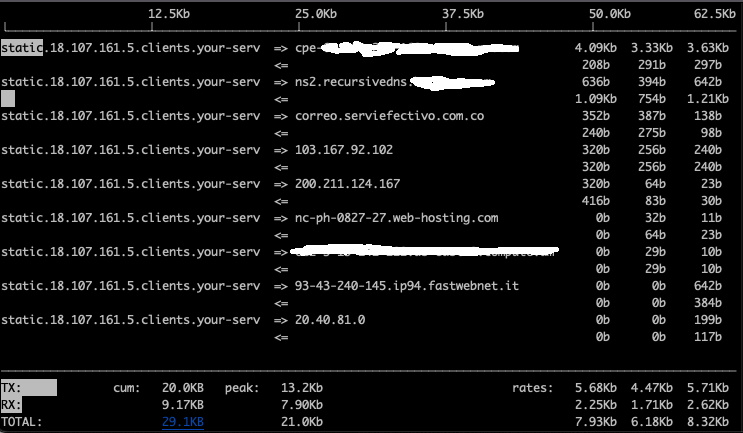
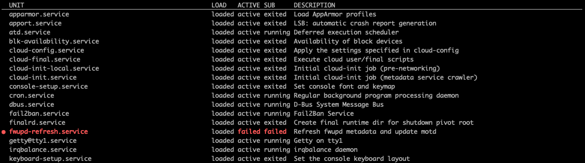

## Administration

### Installation


In the beginning we will do a simple installation to get us up and running and come back around to better understand certain aspects. I do want to instill the idea that operating systems can and probably should be reinstalled often. 

Becoming comfortable moving between different operating systems and install has multiple advantages. 

The primary reason is if you do happen to pick up some kind of sleeper malware or other undesirable digital artifact when you start from scratch that attack vector will have to also start from square one as well.

Another reason is that it is a good exercise in making sure you know where all your data, software licenses are periodically can prevent unexpected surprises. As good system administrators we should always be looking to automate to make our jobs easier and less stressful. Our personal computing environments should be no different. Peace of mind knowing that you can get back up quickly if you have some kind of hardware failure is invaluable.

### Booting

There are really 4 stages to the boot process from power button to log in screen.

#### Firmware Stage

Firmware refers to low-level software that interfaces directly with all the hardware in your system. The `firmware stage` standard was originally called `BIOS` but the newer standard is called `UEFI`. You might hear it referred to as `BIOS` by some people. In fact many motherboards still support both. In most cases unless you are dealing with an older operating system you will not have to worry about it. But they are different standards. 

During this stage of the boot the system does basic checks of all the hardware and connected peripherals to make sure things are happy enough to proceed to the next stage of the boot. 

**If you have problems with getting passed this stage of the boot you might be able to upgrade the firmware for the system to fix the issue. Check the website of the manufacturer of your motherboard/system to see if this is an option.**

This is also the stage of the boot process that you must intervene in order to boot from different media (like a USB stick) if you want to install a new operating system. 

Each manufacturer has different keys that will do this. Dell typically uses `F2` to get into the `BIOS` only and then `F12` that will bring up a boot menu and let you select which device to continue the boot process using.

Once we have told the firmware which media we want to boot, the system will examine the beginning of the disk to determine what partitions are defined and which partition is `active` we can proceed to the next step. 

#### Bootloader Stage

Next, the system will look inside the `active` partition and in most all cases with linux will launch a program called `grub`

We will go into more detail about `grub` aka the `Grand Unified Bootloader` but it is by far the most common bootloader software used today.

Like the BIOS/UEFI process. This process can also be paused and modified to perform emergency recovery or boot to completely different operating systems.

In fact you can have GRUB let you load either Windows or Linux at boot time if you have two Operating Systems installed.

This boot partitions can be on disk physically attached to the system or it could also be an image the is downloaded over the network via `TFTP` (trivial file transfer protocol) as is the case with `PXE` (pronounced pixie) or `Pre Execution Environment`. AKA Network booting.

[Great Overview of MBR boot process](https://neosmart.net/wiki/mbr-boot-process/)

Now that this initial kernel is loaded into memory, We are now ready to start the next stage:

#### Kernel Stage

The next stage can get tricky as while there is a running kernel, it probably does not have a way to talk to much of the system hardware (device drivers). Remember this is very basic kernel loaded by the bootloader stage. There is a separate partition that contains the kernel called `/boot`. 

The goal is to get the kernel up and running with device drivers loaded and the `/` filesystem mounted. This can be a problem if the currently running kernel does not have a way to talk to the device the `/` filesystem is on. 

There are two solutions to this problem.

One solution is to create a storage device in system memory (RAM) that can be used to add all the other bits of software needed by the kernel to get that `/` mounted and ready to go. This is called `initrd`.

The other solution is called `intramfs` and essentailly does the same thing but via a different method using ` CPIO` archive format.

[`initrd` or `intramfs`](https://www.baeldung.com/linux/initrd-vs-initramfs) will load the drivers and then remount `/`


Once all of this is finished the last task of this stage is to start `init`.


#### `init` Stage

`Init` is the first process and will always have  `pid` `1`. This is the part of the boot process that is responsible for getting everything else that the system needs to start to do its job up and going. 

There are different ways this can be accomplished.

Until relatively recently the most predominant design standard was called [`System V`](https://en.wikipedia.org/wiki/UNIX_System_V). Named because it was the predecessor to `System III`. 

There are also two new comers to this scene:

1. [Upstart](https://en.wikipedia.org/wiki/Upstart_(software))
2. [Systemd](https://en.wikipedia.org/wiki/Systemd)


Systemd has especially come on strong and is the new de facto standard `init` system for all major linux distributions.

Like everything else in this world, history is very influential and many elements and command associated with `System V` are still present.

Depending on which `init` system is in use will determine which directories are examined to determine what needs to be started.

| `init` method | config directory |
| :---          | :--- |
| System V      | `/etc/init.d` |
| Upstart       | `/etc/init`   |
| Systemd       | `/etc/systemd` |


While `systemd` is by far the most common. It is good to know about the others so that if you run across a system using it you can figure out how to configure.

### Getting System Information

The most common command for getting a quick overview of what is going on in a system is the command `top`. It is most similar to `Task Manager` in Windows and does a really good job of giving you an idea of what the current CPU and system memory (RAM) usage is like. Let's give it a shot.

```bash
top
```


There is also a command called `iotop` that will give you a similar view but instead of CPU and RAM it will show you disk input/output information. Another very common source of system speed degradation.


One last command  in this series `iftop`. `if` stands for interface.  You often might want to know a quick overview of what is going on with your network connections. This is your tool.




Note: In order to run `iotop`or `iftop` you must elevate to `root` privilege via the command `sudo`. We will talk more about `sudo` but it is the primary way we will gain `root` access.


If you are a Windows user you might be familiar with `System Information` and/or `Device Manager` to look at information about the hardware in your computer. Linux GUI's also have similar programs but as you might imagine there are command line ways to do all these things as well.

We have spent quite a bit of time looking at the `ls` command that is used to list files in a filesystem. In a similar vein there exist `ls` commands for your hardware that can give you quick information about your system. On your linux machine launch a terminal shell and let's try out a few of these.

```bash
lscpu | less
```


As you can see there is quite a bit of output but it will tell us about our CPU including the manufacturer and model. Here we have a 6 core AMD Ryzen chip that has 12 cpus (2 cpus per core).

Similarly if we want to see all the devices attached to the PCI bus we can use the `lspci` command:

```bash
lspci | less
```


Here we see things like storage controllers, network cards, video cards, lots of other lower level devices. This command can be useful when troubleshooting to see if a device is being detected by the system.

For the final command in this series we will look at `lsusb`. As you might imagine lists USB devices.


Notice how many different root hub devices there are. 

### `/proc` filesystem

This is a special virtual filesystem that is created at boot time and is destroyed when the system shuts down. It contains lots and lots of information about the running system including running processes. Here is an example:


Notice all the number directories? Each one of these corresponds to the `PID` of a running process. Lets take a closer look.


Some of the files in `/proc` contain summary information. A great example of this is `/proc/meminfo`


In fact many of the previous hardware-based `ls` commands use information from `/proc`. [Here is a great intro blog post](https://andythemoron.com/blog/2017-04-27/Proc-Filesystem).

Another useful and fast command is `free`. Free shows information about system memory. It reads it's  information from `/proc` as well.

```bash
free -h
```


Looking at the hard drives attached to the system is another important task we might want to perform. The most straightforward way to look at the disks the system sees ia with the `lsblk` command.

```bash
lsblk
```


### Kernel Modules

One of the coolest features about the linux kernel is it's use `modules`. `Modules` are just pieces of code that add additional functionality to the linux kernel. The best part about these modules is that they can be loaded and unloaded without rebooting the system. 

You can view the currently loaded `kernel modules` with... you guessed it: `lsmod`

```bash
lsmod
```


As you can see there are lots of these things loaded in a running system. If you look through the list you will see things like `bluetooth` drivers for a Virtualization software called `VirtualBox` that is installed. Modules for video drivers can be seen as well.

`modinfo` is the command that will tell you more information about a particular module if you are not sure what it does.

```bash
modinfo nvidia | less
```


Here we have the module that is responsible for `tls` security. That is the protocol that is used to encrypt your web traffic among other things.

The full module list is rather long so this is a great opportunity to use our friend the `pipe` (`|`) operator and filter for what we are interested in seeing. Let's say we want to know about any intel related modules that are loaded.


As the output indicates there are several places that `intel` shows up in various modules. Awesome.

Loading and unloading these modules is accomplished with the command `modprobe`. Let's take a look with the `joydev` module that is responsible for interfacing with gaming joysticks.

 If we use the incantation from above we can see that the `joydev` module is currently loaded. 

```bash
lsmod | grep joydev
```

Since it is loaded let's proceed to unload it first.

```bash
modprobe -r joydev
```

Oops. This does not work. A regular user is able to list and view `kernel modules` but you must elevate to `root` to be able to load and unload `kernel modules`. Let's use `sudo` and try again.

```bash
sudo modprobe -r joydev
```

Now we have joy! Well technically no joydev but that is what we wanted. Silly us...

```bash
lsmod | grep joy
```

Confirmed... no joy. hahaha

Let's get it back

```bash
sudo modprobe joydev
```

Much better :)
 
 

### Logging

***If there is ever a problem with your system odds are there is a log file somewhere that has the message that you can google to solve your problem.***

You just have to find it...

#### `/var/log`

Many times hardware issues will show up during boot. There is a great little command that will tell you the log messages generated during the current boot. The command is called `dmesg` and it reads the file `/var/log/dmesg` (on Ubuntu). That means the file is overwritten each time a successful boot happens.

```bash
sudo dmesg | less
```


Other common places to look for basic system logs could include (depending on distro):

- `/var/log/messages`
- `/var/log/syslog`


#### Journalctl

Another feature of `systemd` is logging. In fact logging in `systemd` uses a binary file format that must be read through a special utility called `journactl`. If you think you are missing log files in `/var/log` they are probably viewable via `journalctl`.


`Journalctl` is a neat utility. For instance, you can get the boot messages like `dmesg` via:

```bash
sudo journalctl -b
```

`Journalctl` also conveniently will page the results so you do not have to pipe (`|`) to `less`.

There are many filtering options to give you information about specific services or devices.

[Here are more examples](https://www.digitalocean.com/community/tutorials/how-to-use-journalctl-to-view-and-manipulate-systemd-logs)

### Booting

This is one of those topics that can be daunting and scary becuase if you have a problem here your system is not working at all. Gaining confidence in using and manipulating `GRUB` should help dispel some of this anxiety. 

As we mentioned before the most common boot loader program is called `Grub`. Let's take a deeper dive.

`GRUB` (`GRUB2` technically) is another `GNU` project.  `GRUB` has a dynamically generated config that has a more streamlined update process than it's predecessor bootloader called `LILO`.

This also means that you can change the bootloader setting at run time. This is very useful for specifying flags for troubleshooting and also can be used to go into `single user mode` to reset your root password if you forget.

The main thing to remember is that when you make changes to the `GRUB` configuration files you must run a command to read those changes and "make them so" .

### Runlevels

In `System V` and `Upstart` there are seven runlevels 0-6. Each one has a specific meaning and purpose and associated scripts that must be run to switch between the different runlevels.

`Systemd` has similar states but names them differently using something called `targets`.


 This should help make more sense

 | System V and Upstart Runlevel | Associated System State | Systemd target name |
 | :--- | :--- | :--- |
 | `0`  |  Shutdown or `halt` system  |  `poweroff.target` |
 | `1`  | Single user mode (reset root password) | `rescue.target` |
 | `2`  | Multi-User,No GUI, No networking | `multi-user.target` |
 | `3`  | Normal ( no GUI) | `multi-user.target` |
 | `4`  | Not normally used  | `multi-user.target` |
 | `5`  | Normal w/ GUI and Networking | `graphical.target` |
 | `6`  | Restart | `reboot.target` |


 Traditionally with `System V` and `Upstart` the runlevel that the system booted into was defined by the file `/etc/inittab`. You would typically set it to `3` for a normal server without a GUI windowing system or `5` if it did have  GUI.

 An entry in this file might look like:

 > id:3:initdefault:

We can also enter a runlevel directly with the `init` command.

When run as root, `init` will move the system to the specified runlevel.

Want to reboot the system?

```bash
sudo init 6
```

Want to enter non-GUI mode to perhaps do something like install video drivers?

```bash
sudo init 3
```

Try it.

To get back to normal login and then enter or just reboot:

```bash
sudo init 5
```

 In `systemd` however (which is what we are using) to set a default runlevel you must use a symbolic link to link the desired target in `/lib/systemd/system/` to `/etc/systemd/system/default.target` .

 As an example to change the default runlevel:

```bash
sudo rm -f /etc/systemd/system/default.target
```

This command removes the current default target.  **If you left it like this the system would not boot fully**

Now let's make a new `default.target`

```bash
sudo ln -sf /lib/systemd/system/graphical.target /etc/systemd/system/default.target
```

This command will make the GUI login be the default state the machine will come up into on boot.

The different runlevels really just runs a set of scripts that cause the system to start and stop `services` to achieve these states.

A `service` (aka daemon) is a program that runs in the background automatically with no direct user interaction. This does some management or provides functionality that is used by other processes.

#### Systemctl

Systemd has a very useful command called `systemctl` that is used to examine and control the state of running services and even how systemd is configured.

A `service` has 4 states in `systemd`:

| State | Description |
| :---  | :--- |
| Enabled | The service will start on boot. | 
| Disabled | The service will NOT start on boot. |
| Active | The service is currently running |
| Inactive | The service is not running |

#### Listing all Services

In order to list all the `service units` as systemd calls them we can run the following command.

```bash
systemctl list-units --type=service
```



As you can see it lists the service name, status, and a description. Also of note is that it automatically pages the results if needed like `journalctl`.

Let's now list all the running services.

```bash
systemctl list-units --type=service --state=running
```


You can also get more information about specific services.

```bash
sudo systemctl status ssh
```


Note: The command will run without `sudo` but you get more information if you use `sudo`.

We can also stop and start services with `systemctl`.

```bash
sudo systemctl stop fail2ban.service
sudo systemctl status fail2ban.service
sudo systemctl start fail2ban.service
sudo systemctl status fail2ban.service
```


We can also disable a service so it will not start at the next boot like so...

```bash
sudo systemctl disable fail2ban.service
```

### Local Storage Planning

Let's go back and revisit the installation process and a topic we skipped when we told the installer  to *Erase disk and Install Linux*.

This discussion is primarily geared towards a linux system that will run on a larger piece of hardware with specialized needs. For the purposes of using linux in a modern virtualized / containerized environment this is less relevant but still important to understand for troubleshooting and recovery purposes.

As we will see there are newer tools to help ease the pain that comes from the rigidness of `partitions` but typically once a `partition` is defined and a `filesystem` is placed inside there are few options for changing like making the space bigger if you run out of room for instance.

#### Mass Storage Device Partitioning

A hard drive (whether `HDD` or `SSD` ) when it is first made is just a blank canvas. It presents a series of `blocks` (hence the name `block` device) in preset sizes to the system. However before we can put the scaffolding that will actually hold the files and directories for our OS (`filesystem`) we must first setup guardrails.

The first of these guardrails are called `partitions`.

In the case of traditional hard drives with spinning disks and read heads there are a lot of issues related to the physical geometry of the device and how the data was stored. It all started with some of the first magnetic media every developed and still continues to this day in the case of `HDD`'s (drives with spinning disks). These discussions are largely becoming relegated to history as Solid State drives take over more and more of the storage market. In SSD's the way you address and access data is much more straightforward like RAM. 


- 
- 
- 


The take away here is that you need a `partition` that sets up the space that a given filesystem will inhabit.

Partitions are numbered and show up as separate device files in `/dev`. The name of the device will depend on what kind of device it is. `sd` is very common and can refer to different types of drives such as `SATA` and `USB` devices. On the computer I am using there is an `nvme` drive named `nvme0`. The `n1` refers to the namespace and it is a feature specific to nvme drives. At the end you can still see the partitions named `p1`, `p2`  


There are two types of partitions:

1. Primary
2. Extended

You can only have `4` `primary partitions` per drive. This might seem limiting but you can also create one of the four partitions as an `extended partition`. This allows you to specify up to 63 partitions in most linux distributions. In practice primary partitions are all you need.

#### MBR and GPT 

We have so far mainly been referring to `MBR`. `MBR` has a limitation of 2 TB being largest partition size you can create. Once drives started getting bigger than 2 TB this became a problem. Luckily `GPT` was ready to take over.

GUID Partition Table (`GPT`) can support disk sizes up to 9 `ZB` and uses a globally unique identifier for each partition and can support a maximum of 128 partitions per disk.


All partitioning schemes require special software to create and manage partitions. In the case of `MBR` and `GPT` the canonical tools are `fdisk` and `gdisk` respectively. Although `fdisk` can deal with `GPT` partitions as well not in most modeern distros.

#### Filesystems

Once you have your partitions created, before you can `mount` and starting using the space you must first create a `filesystem`.

A filesystem is what stores and retrieves your files. It maintains a map of where on the disk that all the pieces to a file at a given path are located. 

Apple has their own filesystem called `AFS`. Microsoft has it's own filesystem called `NTFS`. Linux supports many filesystems.

#### Data and Metadata

The contents of the files are the actual `data`. The filesystem is also responsible for storing data about the files. Also known as `metadata`. Metadata might include things like permissions, timestamps, owner information, etc. Each entry in the filesystem consumes one `inode`. As a reminder: If you run out of `inodes` even if you have space left on the disk teh filesystem does not have a way to use it.

#### Linux filesystem

Linux supports a wide variety of filesystems. Some such as `zfs` are truly next level systems unto themselves capable of dealing with very large storage systems and in a manner that is extremely reliable. 

Another common format is `ISO`. It was originally designed for optical discs but it is widely used today as a format to distribute operating system installation media.

The main feature that separates modern filesystems is called `journaling`. `Journaling` works by writing all of the changes that are to be made in before it performs them. This may seem inefficient but in practice this allows the most recent steps to be examined in the event of a sudden power loss so that the system can gracefully recover

By far the most commonly used however is `ext4`. It is the default for all of the distributions I am aware.

The main point is that you need three things to happen in order to be able to read and write files to a physical filesystem.

1. Create a Partition 
2. Create a filesystem inside the partition.
3. Mount the filesystem

#### Mountpoints

A `mountpoint` is where in the tree of the currently running operating system a filesystem is made available. 

If there is only one partition and one physical filesystem this mountpoint must be `/`. 


