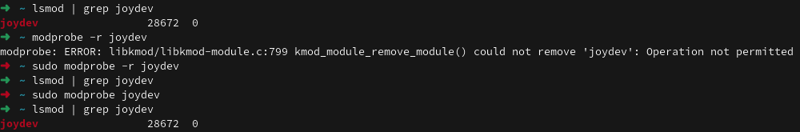
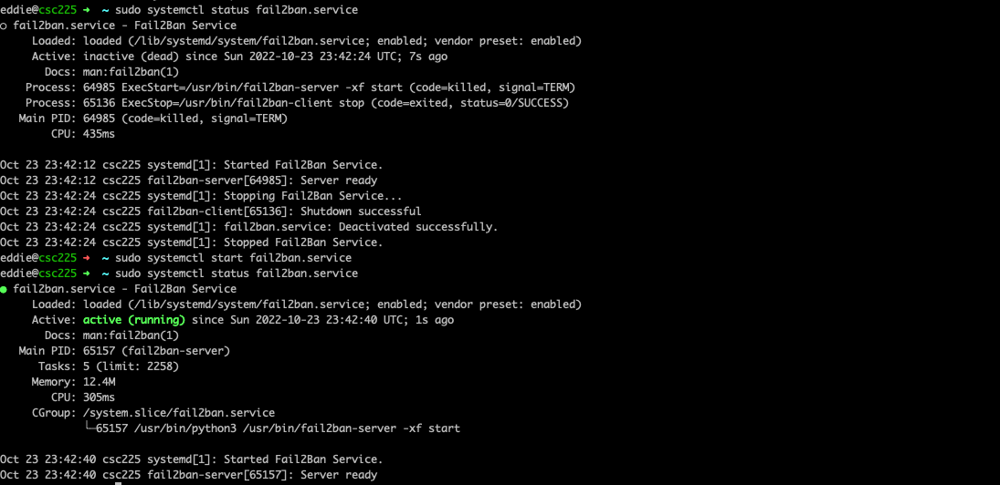
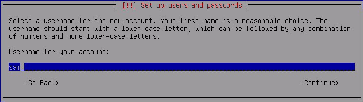

## Administration

### Installation


In the beginning we will do a simple installation to get us up and running and come back around to better understand certain aspects. I do want to instill the idea that operating systems can and probably should be reinstalled often. 

Becoming comfortable moving between different operating systems and install has multiple advantages. 

The primary reason is if you do happen to pick up some kind of sleeper malware or other undesirable digital artifact when you start from scratch that attack vector will have to also start from square one as well.

Another reason is that it is a good exercise in making sure you know where all your data, software licenses are periodically can prevent unexpected surprises. As good system administrators we should always be looking to automate to make our jobs easier and less stressful. Our personal computing environments should be no different. Peace of mind knowing that you can get back up quickly if you have some kind of hardware failure is invaluable.

### Booting

There are really 4 stages to the boot process from power button to log in screen.

#### Firmware Stage

Firmware refers to low-level software that interfaces directly with all the hardware in your system. The `firmware stage` standard was originally called `BIOS` but the newer standard is called `UEFI`. You might hear it referred to as `BIOS` by some people. In fact many motherboards still support both. In most cases unless you are dealing with an older operating system you will not have to worry about it. But they are different standards. 

During this stage of the boot the system does basic checks of all the hardware and connected peripherals to make sure things are happy enough to proceed to the next stage of the boot. 

**If you have problems with getting passed this stage of the boot you might be able to upgrade the firmware for the system to fix the issue. Check the website of the manufacturer of your motherboard/system to see if this is an option.**

This is also the stage of the boot process that you must intervene in order to boot from different media (like a USB stick) if you want to install a new operating system. 

Each manufacturer has different keys that will do this. Dell typically uses `F2` to get into the `BIOS` only and then `F12` that will bring up a boot menu and let you select which device to continue the boot process using.

Once we have told the firmware which media we want to boot, the system will examine the beginning of the disk to determine what partitions are defined and which partition is `active` we can proceed to the next step. 

#### Bootloader Stage

Next, the system will look inside the `active` partition and in most all cases with linux will launch a program called `grub`

We will go into more detail about `grub` aka the `Grand Unified Bootloader` but it is by far the most common bootloader software used today.

Like the BIOS/UEFI process. This process can also be paused and modified to perform emergency recovery or boot to completely different operating systems.

In fact you can have GRUB let you load either Windows or Linux at boot time if you have two Operating Systems installed.

This boot partitions can be on disk physically attached to the system or it could also be an image the is downloaded over the network via `TFTP` (trivial file transfer protocol) as is the case with `PXE` (pronounced pixie) or `Pre Execution Environment`. AKA Network booting.

[Great Overview of MBR boot process](https://neosmart.net/wiki/mbr-boot-process/)

Now that this initial kernel is loaded into memory, We are now ready to start the next stage:

#### Kernel Stage

The next stage can get tricky as while there is a running kernel, it probably does not have a way to talk to much of the system hardware (device drivers). Remember this is very basic kernel loaded by the bootloader stage. There is a separate partition that contains the kernel called `/boot`. 

The goal is to get the kernel up and running with device drivers loaded and the `/` filesystem mounted. This can be a problem if the currently running kernel does not have a way to talk to the device the `/` filesystem is on. 

There are two solutions to this problem.

One solution is to create a storage device in system memory (RAM) that can be used to add all the other bits of software needed by the kernel to get that `/` mounted and ready to go. This is called `initrd`.

The other solution is called `intramfs` and essentailly does the same thing but via a different method using ` CPIO` archive format.

[`initrd` or `intramfs`](https://www.baeldung.com/linux/initrd-vs-initramfs) will load the drivers and then remount `/`


Once all of this is finished the last task of this stage is to start `init`.


#### `init` Stage

`Init` is the first process and will always have  `pid` `1`. This is the part of the boot process that is responsible for getting everything else that the system needs to start to do its job up and going. 

There are different ways this can be accomplished.

Until relatively recently the most predominant design standard was called [`System V`](https://en.wikipedia.org/wiki/UNIX_System_V). Named because it was the predecessor to `System III`. 

There are also two new comers to this scene:

1. [Upstart](https://en.wikipedia.org/wiki/Upstart_(software))
2. [Systemd](https://en.wikipedia.org/wiki/Systemd)


Systemd has especially come on strong and is the new de facto standard `init` system for all major linux distributions.

Like everything else in this world, history is very influential and many elements and command associated with `System V` are still present.

Depending on which `init` system is in use will determine which directories are examined to determine what needs to be started.

| `init` method | config directory |
| :---          | :--- |
| System V      | `/etc/init.d` |
| Upstart       | `/etc/init`   |
| Systemd       | `/etc/systemd` |


While `systemd` is by far the most common. It is good to know about the others so that if you run across a system using it you can figure out how to configure.

### Getting System Information

The most common command for getting a quick overview of what is going on in a system is the command `top`. It is most similar to `Task Manager` in Windows and does a really good job of giving you an idea of what the current CPU and system memory (RAM) usage is like. Let's give it a shot.

```bash
top
```


There is also a command called `iotop` that will give you a similar view but instead of CPU and RAM it will show you disk input/output information. Another very common source of system speed degradation.


One last command  in this series `iftop`. `if` stands for interface.  You often might want to know a quick overview of what is going on with your network connections. This is your tool.


Note: In order to run `iotop`or `iftop` you must elevate to `root` privilege via the command `sudo`. We will talk more about `sudo` but it is the primary way we will gain `root` access.


If you are a Windows user you might be familiar with `System Information` and/or `Device Manager` to look at information about the hardware in your computer. Linux GUI's also have similar programs but as you might imagine there are command line ways to do all these things as well.

We have spent quite a bit of time looking at the `ls` command that is used to list files in a filesystem. In a similar vein there exist `ls` commands for your hardware that can give you quick information about your system. On your linux machine launch a terminal shell and let's try out a few of these.

```bash
lscpu | less
```


As you can see there is quite a bit of output but it will tell us about our CPU including the manufacturer and model. Here we have a 6 core AMD Ryzen chip that has 12 cpus (2 cpus per core).

Similarly if we want to see all the devices attached to the PCI bus we can use the `lspci` command:

```bash
lspci | less
```


Here we see things like storage controllers, network cards, video cards, lots of other lower level devices. This command can be useful when troubleshooting to see if a device is being detected by the system.

For the final command in this series we will look at `lsusb`. As you might imagine lists USB devices.


Notice how many different root hub devices there are. 

### `/proc` filesystem

This is a special virtual filesystem that is created at boot time and is destroyed when the system shuts down. It contains lots and lots of information about the running system including running processes. Here is an example:


Notice all the number directories? Each one of these corresponds to the `PID` of a running process. Lets take a closer look.


Some of the files in `/proc` contain summary information. A great example of this is `/proc/meminfo`


In fact many of the previous hardware-based `ls` commands use information from `/proc`. [Here is a great intro blog post](https://andythemoron.com/blog/2017-04-27/Proc-Filesystem).

Another useful and fast command is `free`. Free shows information about system memory. It reads it's  information from `/proc` as well.

```bash
free -h
```


Looking at the hard drives attached to the system is another important task we might want to perform. The most straightforward way to look at the disks the system sees ia with the `lsblk` command.

```bash
lsblk
```


### Kernel Modules

One of the coolest features about the linux kernel is it's use `modules`. `Modules` are just pieces of code that add additional functionality to the linux kernel. The best part about these modules is that they can be loaded and unloaded without rebooting the system. 

You can view the currently loaded `kernel modules` with... you guessed it: `lsmod`

```bash
lsmod
```


As you can see there are lots of these things loaded in a running system. If you look through the list you will see things like `bluetooth` drivers for a Virtualization software called `VirtualBox` that is installed. Modules for video drivers can be seen as well.

`modinfo` is the command that will tell you more information about a particular module if you are not sure what it does.

```bash
modinfo nvidia | less
```


Here we have the module that is responsible for `tls` security. That is the protocol that is used to encrypt your web traffic among other things.

The full module list is rather long so this is a great opportunity to use our friend the `pipe` (`|`) operator and filter for what we are interested in seeing. Let's say we want to know about any intel related modules that are loaded.


As the output indicates there are several places that `intel` shows up in various modules. Awesome.

Loading and unloading these modules is accomplished with the command `modprobe`. Let's take a look with the `joydev` module that is responsible for interfacing with gaming joysticks.

 If we use the incantation from above we can see that the `joydev` module is currently loaded. 

```bash
lsmod | grep joydev
```

Since it is loaded let's proceed to unload it first.

```bash
modprobe -r joydev
```

Oops. This does not work. A regular user is able to list and view `kernel modules` but you must elevate to `root` to be able to load and unload `kernel modules`. Let's use `sudo` and try again.

```bash
sudo modprobe -r joydev
```

Now we have joy! Well technically no joydev but that is what we wanted. Silly us...

```bash
lsmod | grep joy
```

Confirmed... no joy. hahaha

Let's get it back

```bash
sudo modprobe joydev
```

Much better :)
 
 

### Logging

***If there is ever a problem with your system odds are there is a log file somewhere that has the message that you can google to solve your problem.***

You just have to find it...

#### `/var/log`

Many times hardware issues will show up during boot. There is a great little command that will tell you the log messages generated during the current boot. The command is called `dmesg` and it reads the file `/var/log/dmesg` (on Ubuntu). That means the file is overwritten each time a successful boot happens.

```bash
sudo dmesg | less
```


Other common places to look for basic system logs could include (depending on distro):

- `/var/log/messages`
- `/var/log/syslog`


#### Journalctl

Another feature of `systemd` is logging. In fact logging in `systemd` uses a binary file format that must be read through a special utility called `journactl`. If you think you are missing log files in `/var/log` they are probably viewable via `journalctl`.


`Journalctl` is a neat utility. For instance, you can get the boot messages like `dmesg` via:

```bash
sudo journalctl -b
```

`Journalctl` also conveniently will page the results so you do not have to pipe (`|`) to `less`.

There are many filtering options to give you information about specific services or devices.

[Here are more examples](https://www.digitalocean.com/community/tutorials/how-to-use-journalctl-to-view-and-manipulate-systemd-logs)

### Booting

This is one of those topics that can be daunting and scary because if you have a problem here your system is not working at all. Gaining confidence in using and manipulating `GRUB` should help dispel some of this anxiety. 

As we mentioned before the most common boot loader program is called `Grub`. Let's take a deeper dive.

`GRUB` (`GRUB2` technically) is another `GNU` project.  `GRUB` has a dynamically generated config that has a more streamlined update process than it's predecessor bootloader called `LILO`.

This also means that you can change the bootloader setting at run time. This is very useful for specifying flags for troubleshooting and also can be used to go into `single user mode` to reset your root password if you forget.

The main thing to remember is that when you make changes to the `GRUB` configuration files you must run a command to read those changes and "make them so" .

### Runlevels

In `System V` and `Upstart` there are seven runlevels 0-6. Each one has a specific meaning and purpose and associated scripts that must be run to switch between the different runlevels.

`Systemd` has similar states but names them differently using something called `targets`.


 This should help make more sense

 | System V and Upstart Runlevel | Associated System State | Systemd target name |
 | :--- | :--- | :--- |
 | `0`  |  Shutdown or `halt` system  |  `poweroff.target` |
 | `1`  | Single user mode (reset root password) | `rescue.target` |
 | `2`  | Multi-User,No GUI, No networking | `multi-user.target` |
 | `3`  | Normal ( no GUI) | `multi-user.target` |
 | `4`  | Not normally used  | `multi-user.target` |
 | `5`  | Normal w/ GUI and Networking | `graphical.target` |
 | `6`  | Restart | `reboot.target` |


 Traditionally with `System V` and `Upstart` the runlevel that the system booted into was defined by the file `/etc/inittab`. You would typically set it to `3` for a normal server without a GUI windowing system or `5` if it did have  GUI.

 An entry in this file might look like:

 > id:3:initdefault:

We can also enter a runlevel directly with the `init` command.

When run as root, `init` will move the system to the specified runlevel.

Want to reboot the system?

```bash
sudo init 6
```

Want to enter non-GUI mode to perhaps do something like install video drivers?

```bash
sudo init 3
```

Try it.

To get back to normal login and then enter or just reboot:

```bash
sudo init 5
```

#### Systemctl

Systemd has a very useful command called `systemctl` that is used to examine and control the state of running services, targets (aka runlevels) and even how systemd is configured.


The state that the machine will come up into automatically is called the `default target`. To see what the current default target is we can run:

```bash
systemctl get-default
```


You can also see the current runlevel using the old System V method.

```bash
runlevel
```


If we want to switch the current running target to multi-user.target (runlevel 3)

```bash
systemctl isolate multi-user.target
```


Switching between the different targets/runlevels really just runs a set of scripts that cause the system to start and stop `services` to achieve these states.

A `service` (aka daemon) is a program that runs in the background automatically with no direct user interaction. This does some management or provides functionality that is used by other processes.


A `service` has 4 states in `systemd`:

| State | Description |
| :---  | :--- |
| Enabled | The service will start on boot. | 
| Disabled | The service will NOT start on boot. |
| Active | The service is currently running |
| Inactive | The service is not running |

#### Listing all Services

In order to list all the `service units` as systemd calls them we can run the following command.

```bash
systemctl list-units --type=service
```


As you can see it lists the service name, status, and a description. Also of note is that it automatically pages the results if needed like `journalctl`.

Let's now list all the running services.

```bash
systemctl list-units --type=service --state=running
```


You can also get more information about specific services.

```bash
sudo systemctl status ssh
```


Note: The command will run without `sudo` but you get more information if you use `sudo`.

We can also stop and start services with `systemctl`.

```bash
sudo systemctl stop fail2ban.service
sudo systemctl status fail2ban.service
sudo systemctl start fail2ban.service
sudo systemctl status fail2ban.service
```




We can also disable a service so it will not start at the next boot like so...

```bash
sudo systemctl disable fail2ban.service
```

### Local Storage Planning

Let's go back and revisit the installation process and a topic we skipped when we told the installer  to *Erase disk and Install Linux*.

This discussion is primarily geared towards a linux system that will run on a larger piece of hardware with specialized needs. For the purposes of using linux in a modern virtualized / containerized environment this is less relevant but still important to understand for troubleshooting and recovery purposes.

As we will see there are newer tools to help ease the pain that comes from the rigidness of `partitions` but typically once a `partition` is defined and a `filesystem` is placed inside there are few options for changing like making the space bigger if you run out of room for instance.

#### Mass Storage Device Partitioning

A hard drive (whether `HDD` or `SSD` ) when it is first made is just a blank canvas. It presents a series of `blocks` (hence the name `block` device) in preset sizes to the system. However before we can put the scaffolding that will actually hold the files and directories for our OS (`filesystem`) we must first setup guardrails.

The first of these guardrails are called `partitions`.

In the case of traditional hard drives with spinning disks and read heads there are a lot of issues related to the physical geometry of the device and how the data was stored. It all started with some of the first magnetic media every developed and still continues to this day in the case of `HDD`'s (drives with spinning disks). These discussions are largely becoming relegated to history as Solid State drives take over more and more of the storage market. In SSD's the way you address and access data is much more straightforward like RAM. 


- 
- 
- 


The take away here is that you need a `partition` that sets up the space that a given filesystem will inhabit.

Partitions are numbered and show up as separate device files in `/dev`. The name of the device will depend on what kind of device it is. `sd` is very common and can refer to different types of drives such as `SATA` and `USB` devices. On the computer I am using there is an `nvme` drive named `nvme0`. The `n1` refers to the namespace and it is a feature specific to nvme drives. At the end you can still see the partitions named `p1`, `p2`  


There are two types of partitions:

1. Primary
2. Extended

You can only have `4` `primary partitions` per drive. This might seem limiting but you can also create one of the four partitions as an `extended partition`. This allows you to specify up to 63 partitions in most linux distributions. In practice primary partitions are all you need.

#### MBR and GPT 

We have so far mainly been referring to `MBR`. `MBR` has a limitation of 2 TB being largest partition size you can create. Once drives started getting bigger than 2 TB this became a problem. Luckily `GPT` was ready to take over.

GUID Partition Table (`GPT`) can support disk sizes up to 9 `ZB` and uses a globally unique identifier for each partition and can support a maximum of 128 partitions per disk.


All partitioning schemes require special software to create and manage partitions. In the case of `MBR` and `GPT` the canonical tools are `fdisk` and `gdisk` respectively. Although `fdisk` can deal with `GPT` partitions as well not in most modeern distros.

#### Filesystems

Once you have your partitions created, before you can `mount` and starting using the space you must first create a `filesystem`.

A filesystem is what stores and retrieves your files. It maintains a map of where on the disk that all the pieces to a file at a given path are located. 

Apple has their own filesystem called `AFS`. Microsoft has it's own filesystem called `NTFS`. Linux supports many filesystems.

#### Data and Metadata

The contents of the files are the actual `data`. The filesystem is also responsible for storing data about the files. Also known as `metadata`. Metadata might include things like permissions, timestamps, owner information, etc. Each entry in the filesystem consumes one `inode`. As a reminder: If you run out of `inodes` even if you have space left on the disk teh filesystem does not have a way to use it.

#### Linux filesystem

Linux supports a wide variety of filesystems. Some such as `zfs` are truly next level systems unto themselves capable of dealing with very large storage systems and in a manner that is extremely reliable. 

Another common format is `ISO`. It was originally designed for optical discs but it is widely used today as a format to distribute operating system installation media.

The main feature that separates modern filesystems is called `journaling`. `Journaling` works by writing all of the changes that are to be made in before it performs them. This may seem inefficient but in practice this allows the most recent steps to be examined in the event of a sudden power loss so that the system can gracefully recover

By far the most commonly used however is `ext4`. It is the default for all of the distributions I am aware.

The main point is that we need three things to happen in order to be able to read and write files to a physical filesystem.

1. Create a Partition 
2. Create a filesystem inside the partition.
3. Mount the filesystem

#### Mountpoints

A `mountpoint` is where in the tree of the currently running operating system a filesystem is made available. 

If there is only one partition and one physical filesystem this mountpoint must be `/`. 

You can have more than one disk mounted in a given `virtual filesystem` that makes up a running system. Each physical filesystem must have a place to be accessed (ie mountpoint).

Outside of being able to boot more than one operating system, Another common practice is to make a separate partition for `/var/log` so that if we fill up that space the rest of your system will not crash. 

You might also mount a filesystem on a remote machine to store things like user's home directories.

Anytime we place a USB stick into a linux machine it will mount it somewhere in the directory tree so that it can be accessed `/media/` for instance.

#### fdisk gdisk

As we have seen in the installation process, before we can install a new Operating System we must first create at least one partition for the new operating system to live.

In our case we just let the installer use all of the disk and it did the heavy lifting for us. We can also do this process more manually and after the installation process has been completed.

We have discussed the difference between `MBR` and `GPT` partitioning. The classic partitioning tools for these are `fdisk` and `gdisk` respectively.

Both of these tools are similar in the way they operate. In fact newer versions of `fdisk` can also deal with `GPT` partitions.

You can use fdisk with `-l` in non-interactive mode where it will come back to the prompt each time but the way we are going to use `fdisk` is in interactive mode. 

When you run `fdisk` you must also specify a disk in which to perform the operations. If you are unsure which device is the correct one you can run commands like `lsblk` or `lsudb` to find the correct device file.


```bash
sudo fdisk /dev/sda 
```

Since this device is a `USB` Ubuntu installer that is automatically mounted (or at least attempted to be automatically mounted) we get a warning telling us that the device is mounted and you could lose data. Pro Tip: Whenever you are re-partitioning you are going to lose data. Just make sure you are losing data you don't care about!


Once we are in the app, the first command we might want to do is list the partitions that are already on the disk. We can do this with the `p` entry from the menu.


Here we see the partitions on our `USB` installer. Notice there are 4 partitions in this example. Depending on the contents of your USB stick you could have more or less than 4 partitions. 

It says `Microsoft` on the first and 3rd. These partitions are  an early version of Microsoft filesystems in the `FAT` format that is more compatible and will allow the early stages of the boot to complete.

Let's say we want to make this disk have one partition that we can use this device to store files. 

What would we need to do?

** Warning. Please make sure you have downloaded the `ISO` installer for your linux distribution to your machine before you start this exercise so you can recover **

The first step would be to delete the existing partitions. We need to first remind ourselves what we can do in `fdisk` with the `m` entry.


We can see that `d` is the option that we want. Now we can delete all four partitions.


** Note: At this point no changes have been written and if we exit at this point nothing would be done to the disk. **

Let's go ahead and delete the partitions using using the `w` command to write the changes and exit `fdisk`.


Ooops! What happened? Why do we get an error?

It is because the disk is mounted. Linux is trying to prevent you from shooting yourself in the foot and blowing away a mounted filesystem.

What can we do to fix? What should have we done differently?

The fix as you might imagine is to un-mount the disk first. We can do this with the `umount` command.


As it turns out `fdisk` did in fact remove the partitions. It did not remove the mount point which is why `fdisk` complained. Once we remove the mount point and relaunch `fdisk` we can see the partitions are in fact gone.


Mow that we have gotten rid of our partitions let's create a new one to hold our filesystem.

If we hit `m` again we will see that the option to create a new partition is `n`. We will take the default suggestions on size to create a partition that spans the entire disk.


Now we have our partition created. Step 1 accomplished. Next we want to create a new filesystem on our new partition of the USB drive to store our files.

This is accomplished by `mkfs`. `mkfs` will do `ext2`, `ext3` or `ext4`. Since we are using `ext4` the command would be:

```bash
sudo mkfs.ext4 /dev/sda1
```
Note this time we specified the partition and not the disk like we did with `fdisk`


As you can see the formatting process creates multiple `super blocks`. `super blocks` are like entry gateways into the filesystem. They know where everything else is. There are multiples in case some are damaged along the way in the life of the filesystem on your drive.

OK now we have step 2 of 3 completed.... We have a partition (Step 1) and a new filesyetsm (Step 2). Now we just need to `mount` the filesystem to be able to use it.

But before that...

Let's switch gears a bit first and grab the `iso` installer for Debian 11 and talk a bit about checksums. Here is the download link:


Remember our discussion of hashing algorithms? Here is yet another use-case for them.

All downloads for linux isos (or any iso really) should have some kind of checksum. In our case debian provides sha512 checksums to check the integrity of what you end up with from the download. `SHA512` is one of those hashing algorithms that we have discussed before. In this case the hashing algorithm is used to verify the integrity of the downloaded iso file. In order to do this you can use the program `sha512sum` with the sole argument as the debian iso file.

```bash
sha512sum debian-11.5.0-amd64-netinst.iso
```


The output you get from the command should match what is found on the link on the [page](https://cdimage.debian.org/debian-cd/current/amd64/iso-cd/SHA512SUMS). If you don't trust what is on the page at all you can verify that the signatures were signed by debian. I will leave that as an exercise for you to complete on your own. :)

If you just clicked on the link you should have an `iso` file in `~/Downloads`

```
ls ~/Downloads
```

Ok back to step 3 on using a filesystem... Mounting

You already know what `mounting`. You do it (or it is done for you) every time you insert a USB stick into a computer. 

Whether it is Windows, Mac or Linux an operating system  will typically attempt to automatically `mount` that device. In Ubuntu when this happens the mountpoint is located in `/media/<your username>`. Since we have just formatted this filesystem on this flash drive and not inserted it. It is not yet mounted.

In Linux you can mount a filesytem anywhere. In fact to show you what I mean let's do something you may or may down (probably not) want to do in real life.

Let's say that we want the files we download from the internet by default to be stored on our flash drive so that we can take them with us easily. 


Make sure you are not in `~/Downloads` and let's mount the flash drive in `~/Downloads`

```bash
sudo mount /dev/sda1 ~/Downloads

```

At this point when you write files to  `~/Downloads` they will be written to the flash drive we just prepared.

Now let's do  `ls` again.

```
ls ~/Downloads
```


Where is the debian iso?

It is still there it is just not visible because you mounted another filesystem in that directory. Something to keep in mind. 

Every ext4 filesystem has a directory called `lost + found` even if no other files are present. This is used by the filesystem to put anypieces of data it may that looks like a file but does not have a place in the directory structure that it lives.

Alright let's make things normal again and unmount the flash drive.

```bash
sudo umount /dev/sda1
```

I want you guys to have experience installing more than one linux distribution. The next one we will try out is... ??? debian!

Let's prepare this same USB stick as installation media. We will use the `dd` command to do this. 

If you are not already make sure you are in `~/Downloads` and have unmounted the flash drive. You cannot mount or unmount the your current working directory.

```bash
sudo dd if=./debian-11.5.0-amd64-netinst.iso of=/dev/sda
```

This command will take a long time to complete and will not show any progress. 
If successful this command will show summary output.


Now let's load the flash drive with fdisk and see what it says:


The output indicates that this is an `iso9660` format and has two partitions that we did not create. Looks like it worked.

Your task is to use this USB stick and install `debian` 11.

Remember that you can get into the UEFI/BIOS on the Dell laptops by strategically hitting `F12` very shortly after you see the Dell logo appear.

Once you get the installer to load let's select `Install` (The second option)


Please select all default options until you get to the screen where you set the hostname.

The hostname is the name that this computer will be known by to other computers (and humans). You can set whatever you like. Be creative.

This menu is called a `TUI` text user interface. The idea is that works like a graphical interface in that it shows things visually but you still must use the keyboard to interact.

The key to navigate these `TUI`'s is the `TAB` key. 

Once you have decided on a name, hit `TAB` to get to the continue button and hit enter.


We do not have a proxy server so you can just hit `TAB` and enter on the next screen.

Next we will set and confirm the `root` password. Please pick something you can remember. Ideally this would be a high entropy long password that no one knows but is stored somewhere safe.

After we complete the `root` setup, next we create the user that we will use to log in to the machine.

The first screen asks for the full name:


And the next asks for the username.



After you set the password for the first user. The install continues to the time zone selection. We select the appropriate choice and continue on to the disk setup. 

In our case we want to select eh 3rd option to install with LVM and use encryption.


The next step is to select the disk we will use to install. For these laptops we will use the `nvme` drive. 

On the next screen for simplicity let's select the first option to use one partition for everything.

It lastly asks to write changes to the disk and since we selected encryption it will erase the disk before it does the rest.


Why does it do this?

It is because the partition table is stored on a very small portion of the disk and the normal formatting process does not actually go back and write over what was previously on the disk. Someone with the proper tools could scan the disk even after a format and still recover files from what was on the disk from the last time it was used. 

The last step is to set an encryption password. This is yet another password that will be required to decrypt the hard drive and boot the machine. This prevents the security issue from the previous paragraph as while there may be `orphan` data, it will be encrypted.


Select default options and allow the installer to do its thing.

When you get to the end of the installer uncheck the two Desktop options at the top and make sure the `OpenSSH Server` is checked to complete the installation. (Hint: Space Bar selects and un-selects)


When you get to the `GRUB` setup. It will ask you to select a disk. You must arrow down to select the nvme drive.


Note: This install required you to enter three passwords. One for the user you create, one for the root user, and the final one for the disk encryption.  

When you are finished with the install. Reboot into your new Debian OS and log in as your new user.


There are two ways that we will typically use in order to gain `root` privileges. So far we have only seen `sudo`. `sudo` is more configurable and allows you to have more granularity over which commands a given user can or can't run as `root`. 

Debian by default does not have `sudo` installed. Thankfully it does ship with it's grandmother `su`.

`Su` just stands for `super user` and it will allow us to login as root to run commands. Let's do that now.

```bash
su -
``` 

The `-` at the end tells the command that we want a `login` shell.


This is going to be the experience you have whenever you log into a server that does not have a GUI running. This may seem like you are stuck. Let's explore a few things.

Web browser: You might think that since this is cli only that there is no web browser. That would be incorrect! :)

```bash
apt install lynx
```

To launch you just type `lynx`.

It is not very exciting but if you are on a machine with no gui and you need to get to some content on the web it may be one of your only options. Make you realize the importance of the man pages before the web. Also having things printed out so that you can have "dual" screens (One of the screens being a printed page).

Let's make this thing a GUI shall we?

The easiest way to do this is to run the command `tasksel`

```bash
tasksel
```

This might look familiar to you from the end of the Text install. It is a `TUI` that will allow us to select what Windowing system we would like to use. As with most everything else in linux there is usually more than one choice. This is no exception.

![tasksel] (./images/tasksel.png)


The default Windowing system that Ubuntu ships with is called `Gnome`. It is meant to be feature parity replacement to something like Windows or Mac OS. Another popular one is KDE. Let's try it.

Use the same navigation commands and select KDE and let it do it's thing. (Spacebar to select/unselect, TAB to go to `OK`) 

When things come back up it will look something like this:


Log in and kick the tires. It looks different than Gnome and many of the programs are named differently but you will have all the basic programs you might need such as:

1. Browser (Konquerer)
2. File Manager (Dolphin)
3. Text Editor (Kate)
4. Terminal app (Konsole)


If you like Gnome better you can always run `tasksel` again to switch back to it or no GUI (sadist mode) or even to Xfce, etc. XFce is great for machine with older hardware as it is very lightweight.

One of the commands that you will find yourself using over and over is `df`. It stands for `disk free` and show you all the mountpoints the system currently has, where they are and how much free space they have. If is usually best to use the `-h` option to make things `human readable`.

```bash
df -h
```


You can also see the free inodes with the `-i`. This is one of those things that is easy to forget. I have run into it a couple of times and it was always one of the last things I thought about.


** If you run out of inodes you can't write any new files even if you have TONS of free disk space**

Another useful command is `du` which can show you the disk use by directory. This command spits out a lot of output so you usually need to have a strategy in how you want to get information out of it.

One of the ways I like to use `du` is to see how much space the current directory is using. You just change into the directory you are wondering about and run:

```bash
du -ch | grep total
```ß


If we run this without the grep we get a ton of extra output.

One great place to start if you have a full or quickly filling disk is the following command:

```bash
du -sh /*
```


If you ever find yourself in a situation that a filesystem will not mount there is a very useful tool that could prevent you from having to start recovering from backup. `fsck`.

Aside from being one letter off vulgarity you will liking be saying vulgar words if you ever *really* need to use it.

The key to using `fsck` is that you can't fix a filesystem if it is currently mounted.


What does this mean?

In practice this means that if your main system drive has errors you will need to boot up from another disk in order to be able to repair. 

In our case since we are going to use the USB drives


